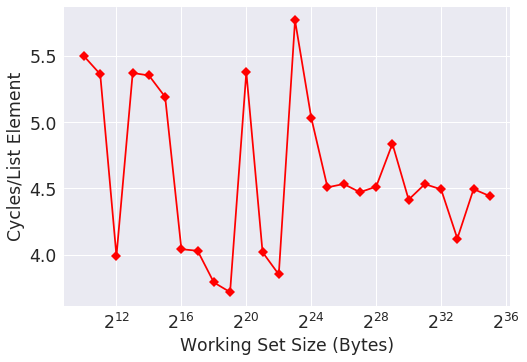

This is what the author has:


(https://lwn.net/Articles/252125/, figure 3.10)

The CPU of my system is Intel(R) Xeon(R) CPU E5-1650 v4 @ 3.60GHz. Here are my results:

```
$ for wss in $(seq 10 35); do echo -n "wss=2^$wss: "; ./seq_read $wss 8; done
wss=2^10: cycles = 1427254672, cycles/op = 5.316938
wss=2^11: cycles = 1445534676, cycles/op = 5.385036
wss=2^12: cycles = 1079326171, cycles/op = 4.020803
wss=2^13: cycles = 1143862056, cycles/op = 4.261218
wss=2^14: cycles = 1078447876, cycles/op = 4.017531
wss=2^15: cycles = 1391490588, cycles/op = 5.183706
wss=2^16: cycles = 1372847796, cycles/op = 5.114257
wss=2^17: cycles = 1081650651, cycles/op = 4.029463
wss=2^18: cycles = 1373049084, cycles/op = 5.115006
wss=2^19: cycles = 1089789887, cycles/op = 4.059784
wss=2^20: cycles = 1041103062, cycles/op = 3.878411
wss=2^21: cycles = 1320265642, cycles/op = 4.918373
wss=2^22: cycles = 1371190647, cycles/op = 5.108083
wss=2^23: cycles = 1192917970, cycles/op = 4.443966
wss=2^24: cycles = 1277411568, cycles/op = 4.758729
wss=2^25: cycles = 1243764213, cycles/op = 4.633383
wss=2^26: cycles = 1402770064, cycles/op = 5.225726
wss=2^27: cycles = 1395645779, cycles/op = 5.199186
wss=2^28: cycles = 1255137580, cycles/op = 4.675752
wss=2^29: cycles = 1292864176, cycles/op = 4.816294
wss=2^30: cycles = 1153548993, cycles/op = 4.297305
wss=2^31: cycles = 1133023986, cycles/op = 4.220843
wss=2^32: cycles = 2270512950, cycles/op = 8.458320
wss=2^33: cycles = 4540201923, cycles/op = 16.913570
wss=2^34: cycles = 9045633303, cycles/op = 33.697610
wss=2^35: cycles = 18054295443, cycles/op = 67.257492
```



Compared to the author, the cycles/op held constant for longer.
