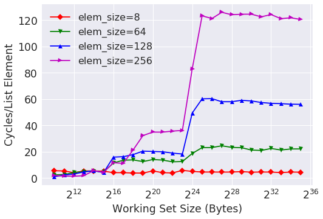

This is what the author has:

(https://lwn.net/Articles/252125/, figure 3.10)

The CPU of my system is Intel(R) Xeon(R) CPU E5-1650 v4 @ 3.60GHz. Here are my results:

Compared to the author, the cycles/op held constant for longer.

To compare multiple elem sizes, the author has

(https://lwn.net/Articles/252125/, Figure 3.11)

I have

My CPU has the following cache sizes:

- L1D: 32 KB per core
- L2: 256 KB per core
- L3: 15 MB

We can clearly see a jump after 2^15, when the working set no longer fits in the L1D.

The next jump in only visible for elem_size=256, at 2^18, when the working set no longer fits in the L2 cache.

Then the jump happens between 2^23 and 2^24, when the working set no longer fits in the L3 cache.
